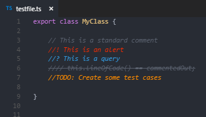

# Better Comments

The Better Comments extension will help you create more human-friendly comments in your code.  
With this extension, you will be able to categorise your annotations into:
* Alerts
* Queries
* TODOs
* Highlights
* Commented out code can also be styled to make it clear the code shouldn't be there
* Any other comment styles you'd like can be specified in the settings



## Configuration

This extension can be configured in User Settings or Workspace settings.

`"better-comments.multilineComments": true`  
 This setting will control whether multiline comments are styled using the annotation tags.
 When false, multiline comments will be presented without decoration.

`"better-comments.highlightPlainText": false`  
This setting will control whether comments in a plain text file are styled using the annotation tags.
When true, the tags (defaults: `! * ? //`) will be detected if they're the first character on a line.

`better-comments.tags`  
The tags are the characters or sequences used to mark a comment for decoration.
The default 5 can be modified to change the colors, and more can be added.

```json
"better-comments.tags": [
  {
    "tag": "!",
    "color": "#FF2D00",
    "strikethrough": false,
    "underline": false,
    "backgroundColor": "transparent",
    "bold": false,
    "italic": false
  },
  {
    "tag": "?",
    "color": "#3498DB",
    "strikethrough": false,
    "underline": false,
    "backgroundColor": "transparent",
    "bold": false,
    "italic": false
  },
  {
    "tag": "//",
    "color": "#474747",
    "strikethrough": true,
    "underline": false,
    "backgroundColor": "transparent",
    "bold": false,
    "italic": false
  },
  {
    "tag": "todo",
    "color": "#FF8C00",
    "strikethrough": false,
    "underline": false,
    "backgroundColor": "transparent",
    "bold": false,
    "italic": false
  },
  {
    "tag": "*",
    "color": "#98C379",
    "strikethrough": false,
    "underline": false,
    "backgroundColor": "transparent",
    "bold": false,
    "italic": false
  }
]
```

## Supported Languages

* Ada
* AL
* Apex
* AsciiDoc
* BrightScript
* C
* C#
* C++
* ColdFusion
* Clojure
* COBOL
* CoffeeScript
* CSS
* Dart
* Dockerfile
* Elixir
* Elm
* Erlang
* F#
* Fortran
* gdscript
* GenStat
* Go
* GraphQL
* Groovy
* Haskell
* Haxe
* HiveQL
* HTML
* Java
* JavaScript
* JavaScript React
* JSON with comments
* Julia
* Kotlin
* LaTex (inlc. Bibtex/Biblatex)
* Less
* Lisp
* Lua
* Makefile
* Markdown
* Nim
* MATLAB
* Objective-C
* Objective-C++
* Pascal
* Perl
* Perl 6
* PHP
* Pig
* PlantUML
* PL/SQL
* PowerShell
* Puppet
* Python
* R
* Racket
* Ruby
* Rust
* SAS
* Sass
* Scala
* SCSS
* ShaderLab
* ShellScript
* SQL
* STATA
* Stylus
* Swift
* Tcl
* Terraform
* Twig
* TypeScript
* TypeScript React
* Verilog
* VHDL
* Visual Basic
* Vue.js
* XML
* YAML
